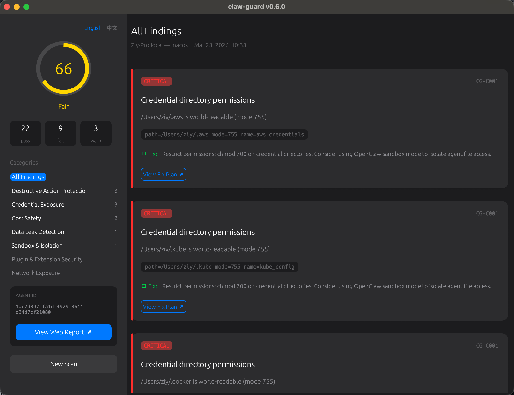

<p align="center">
  
</p>

<h1 align="center">claw-guard</h1>

<p align="center">
  AI-powered host system security audit tool for OpenClaw.<br>
  35 built-in detection rules across 11 categories, extensible via Skills, with LLM-driven attack chain analysis.
</p>

<p align="center">
  Doesn't check if OpenClaw is configured correctly — checks <b>what risks OpenClaw introduces to your host system</b>.
</p>

<p align="center">
  <a href="README.zh-CN.md">中文文档</a>
</p>

<p align="center">
  
</p>

## Quick Start

```sh
# One-line install (macOS / Linux)
curl -fsSL install9.ai/claw-guard | sh

# Windows (PowerShell)
# irm https://install9.ai/claw-guard-win | iex

# Run audit (auto-uploads to install9, server does AI analysis)
claw-guard

# AI-powered audit with your own API key (local analysis)
export CLAW_GUARD_API_KEY=sk-ant-xxx
./claw-guard

# Use other LLM providers
./claw-guard --provider openai --model gpt-4o
./claw-guard --provider ollama --model llama3
./claw-guard --provider deepseek --model deepseek-chat

# Fully offline (no upload, no remote analysis)
./claw-guard --no-upload

# List all supported LLM providers
./claw-guard --list-providers

# List all rules + skills
./claw-guard --list-rules

# Upgrade to latest version
./claw-guard --upgrade

# Remove all local data (~/.claw-guard/)
./claw-guard --purge-data
```

## Example Output

```
  claw-guard v0.6.0 — my-server  (linux)
  2026-03-10T17:00:00+00:00

  ── Category Breakdown ──
  ✗ Credential Exposure             8 checks   6 fail   0 warn
  ✗ Destructive Action Protection   4 checks   3 fail   1 warn
  ✗ Cost Safety                     3 checks   2 fail   0 warn
  ✓ Gateway Configuration           4 checks   0 fail   0 warn
  ✓ File System Security            6 checks   0 fail   0 warn
  ...

  ── Findings ──
  ✗ [CRITICAL] CG-C001 (Credential directory permissions)
    ~/.aws is world-readable (mode 755)
    evidence: path=~/.aws mode=755 name=aws_credentials
    fix: chmod 700 on credential directories.

  ✗ [CRITICAL] CG-M001 (API cost limit not configured)
    No API cost or rate limits configured.
    fix: Set cost limits in openclaw.json.

  ── AI Analysis ──────────────────────────────────

  Summary:
  Your system has a credential theft attack chain: ~/.aws is
  world-readable AND API keys appear in shell history.

  Attack Chains:
  1. [High] Credential theft to cloud compromise
     CG-C001 + CG-C003 + CG-S001 → AWS account takeover
  2. [High] Runaway agent causing financial damage
     CG-M001 + CG-M003 + CG-X001 → Uncontrolled API spend

  Priority Fixes:
  1. chmod 700 ~/.aws ~/.ssh ~/.docker
     ← blocks credential theft chain (CG-C001)

  ─────────────────────────────────────────────────

╔══════════════════════════════════════════════════╗
║              Audit Result Summary                ║
╚══════════════════════════════════════════════════╝
  Score:    52/100  [██████████░░░░░░░░░░] Poor
  Rules: 35  |  Pass: 24  Fail: 20  Warn: 5  Skip: 0
  !! 9 CRITICAL finding(s) !!
  !  6 HIGH finding(s)
```

Exit codes: `0` all clear, `1` HIGH findings, `2` CRITICAL findings. CI/CD friendly.

## AI Analysis

claw-guard uses LLM to go beyond pass/fail — it identifies **attack chains** (combinations of findings that create exploitable paths), prioritizes fixes by impact, and provides environment-specific advice.

### Two Modes

| Mode | How | Best For |
|------|-----|----------|
| **Local** (default) | Your own API key, analysis runs on your machine | Privacy-first, air-gapped environments |
| **Remote** (automatic fallback) | No API key configured — findings are analyzed by install9 platform during upload | Zero-config, continuous monitoring |

### Supported Providers (24)

Use `--list-providers` to see all providers with their default models and base URLs.

| Provider | Flag | Default Model |
|----------|------|---------------|
| Anthropic | `--provider anthropic` | claude-sonnet-4-20250514 |
| OpenAI | `--provider openai` | gpt-4o |
| Ollama (local) | `--provider ollama` | llama3 |
| vLLM (local) | `--provider vllm` | default |
| OpenRouter | `--provider openrouter` | anthropic/claude-sonnet-4-20250514 |
| Together AI | `--provider together` | meta-llama/Llama-3-70b-chat-hf |
| Mistral | `--provider mistral` | mistral-large-latest |
| DeepSeek | `--provider deepseek` | deepseek-chat |
| NVIDIA | `--provider nvidia` | meta/llama-3.1-70b-instruct |
| Moonshot (Kimi) | `--provider moonshot` | moonshot-v1-8k |
| GLM (Zhipu AI) | `--provider glm` | glm-4 |
| Qwen (Alibaba) | `--provider qwen` | qwen-max |
| MiniMax | `--provider minimax` | abab6.5s-chat |
| Hugging Face | `--provider huggingface` | meta-llama/Llama-3-70b-chat-hf |
| Qianfan (Baidu) | `--provider qianfan` | ernie-4.0-8k |
| Amazon Bedrock | `--provider bedrock` | anthropic.claude-sonnet-4-20250514-v1:0 |
| Cloudflare AI Gateway | `--provider cloudflare` | @cf/meta/llama-3-8b-instruct |
| Vercel AI Gateway | `--provider vercel` | gpt-4o |
| LiteLLM | `--provider litellm` | gpt-4o |
| Venice | `--provider venice` | llama-3.1-405b |
| Xiaomi | `--provider xiaomi` | xiaomi-ai-large |
| Z.AI | `--provider zai` | default |
| Kilocode | `--provider kilocode` | default |
| OpenCode Zen | `--provider opencode-zen` | default |

Custom OpenAI-compatible endpoints are supported via `--base-url`:

```sh
# With Anthropic API key (default provider)
export CLAW_GUARD_API_KEY=sk-ant-xxx
claw-guard

# With Ollama (fully offline, no auth needed)
claw-guard --no-upload --provider ollama --model llama3

# Custom endpoint
claw-guard --provider openai --base-url http://my-proxy:8080

# No API key? Just run — server analyzes during upload automatically
claw-guard
```

## Scoring Model

claw-guard uses a **weighted category pass-rate model** (similar to AWS Security Hub / CIS Benchmarks):

- 11 categories, each with an importance weight (total = 100)
- Severity-weighted pass rates within each category
- No single category can drag the entire score to zero
- Warnings earn partial credit (50%), skips earn 80%

| Category | Weight | Rationale |
|----------|--------|-----------|
| Sandbox & Isolation | 15 | Single most impactful control |
| Credential Exposure | 12 | Credential theft → full compromise |
| Network Exposure | 12 | Network exposure → remote attack vector |
| Gateway Configuration | 10 | Gateway auth → command execution |
| Destructive Action Protection | 10 | Prevents rm -rf / data loss |
| Process Security | 10 | Process compromise → host takeover |
| Cost Safety | 8 | Financial risk from API abuse |
| Data Leak Detection | 8 | Data exfiltration |
| Container Security | 5 | Container escape |
| Plugin & Extension Security | 5 | Plugin supply chain attacks |
| File System Security | 5 | File permission issues |

| Score | Grade |
|-------|-------|
| 90-100 | Excellent |
| 75-89 | Good |
| 60-74 | Fair |
| 40-59 | Poor |
| 0-39 | Critical |

## Skills

Skills are community-contributed security checks in Markdown format. Each skill contains a bash command that outputs structured JSON, letting anyone extend claw-guard without writing Rust.

### Using Skills

Drop `.md` files into `~/.claw-guard/skills/` — they are automatically loaded on every run.

```
~/.claw-guard/skills/
├── check-npm-audit.md
├── check-git-secrets.md
└── my-custom-check/
    └── SKILL.md
```

### Writing a Skill

Create a `.md` file with YAML frontmatter and an `## Evaluate` section:

```markdown
---
name: npm-audit
description: Check npm packages for known vulnerabilities
version: 1.0.0
category: plugin
severity: high
id: SK-NPM001
remediation: Run 'npm audit fix'
timeout: 60
---

# npm Audit Check

## Evaluate

\```bash
if ! command -v npm >/dev/null 2>&1; then
  echo '{"status":"skip","detail":"npm not installed"}'
  exit 0
fi
# ... check logic ...
echo '{"status":"pass","detail":"No vulnerabilities found"}'
\```
```

**Output protocol** — each line must be a JSON object:

```json
{"status": "pass|fail|warn|skip", "detail": "description", "evidence": "optional data"}
```

**Frontmatter fields:**

| Field | Required | Description |
|-------|----------|-------------|
| `name` | Yes | Skill name |
| `description` | No | What this skill checks |
| `category` | No | Maps to claw-guard category (credential/network/plugin/etc.) |
| `severity` | No | critical/high/medium/low/info (default: medium) |
| `id` | No | Rule ID (default: auto-generated from name) |
| `remediation` | No | Fix instructions shown on failure |
| `timeout` | No | Max execution time in seconds (default: 30) |

**Security:** Skill commands run with sensitive environment variables stripped (AWS keys, API tokens, etc.) and enforce a timeout. Only install skills you trust.


## Detection Rules

35 built-in rules, each with a unique ID (`CG-XNNN`), category, severity, and remediation advice.

### Credential Exposure (CG-C)

| ID | Rule | Severity |
|----|------|----------|
| CG-C001 | Credential directory permissions (~/.ssh, ~/.aws, ~/.kube, ~/.docker, etc.) | CRITICAL |
| CG-C002 | OpenClaw config file security (openclaw.json, .env, OAuth credentials) | HIGH |
| CG-C003 | Sensitive environment variables (50+ known API key patterns) | HIGH |

### File System Security (CG-F)

| ID | Rule | Severity |
|----|------|----------|
| CG-F001 | Sensitive system file access (/etc/shadow, SAM, etc.) | CRITICAL |
| CG-F002 | SSH host key file permissions | CRITICAL |
| CG-F003 | Legacy config data residue (~/.clawdbot, etc.) | MEDIUM |

### Network Exposure (CG-N)

| ID | Rule | Severity |
|----|------|----------|
| CG-N001 | Wildcard network listeners (gateway bound to 0.0.0.0) | HIGH |
| CG-N002 | Outbound connection audit | HIGH |
| CG-N003 | OpenClaw port surface scan (18789-18899, 9222, 5900, 6080) | MEDIUM |
| CG-N004 | Reverse shell / C2 tool detection | CRITICAL |
| CG-N005 | DNS tunnel exfiltration detection | MEDIUM |

### Process Security (CG-P)

| ID | Rule | Severity |
|----|------|----------|
| CG-P001 | Elevated privilege execution (root/SYSTEM) | HIGH |
| CG-P002 | Dangerous sub-agent flags (--yolo, bypassPermissions) | HIGH |
| CG-P003 | Cron job / scheduled task audit | HIGH |
| CG-P004 | Anomalous child process detection (miners, scanners, proxies) | HIGH |
| CG-P005 | Host compromise assessment (SSH keys, hidden files, CPU mining, login brute force, binary integrity) | CRITICAL |

### Gateway Configuration (CG-G)

| ID | Rule | Severity |
|----|------|----------|
| CG-G001 | Gateway auth mode = none (unauthenticated RCE) | CRITICAL |
| CG-G002 | Dangerous config flags (allowInsecureAuth, dangerouslyDisable*, etc.) | CRITICAL |
| CG-G003 | Secret provider exec path security | HIGH |
| CG-G004 | Gateway token strength | HIGH |

### Sandbox & Isolation (CG-S)

| ID | Rule | Severity |
|----|------|----------|
| CG-S001 | Sandbox mode disabled (all exec runs directly on host) | CRITICAL |
| CG-S002 | Sandbox Docker security bypasses | HIGH |

### Plugin & Extension Security (CG-K)

| ID | Rule | Severity |
|----|------|----------|
| CG-K001 | Plugin inventory audit (plugins run with full host privileges) | HIGH |
| CG-K002 | Plugin directory write protection | HIGH |

### Data Leak Detection (CG-D)

| ID | Rule | Severity |
|----|------|----------|
| CG-D001 | API key leak in shell history / logs | HIGH |
| CG-D002 | Sensitive data in logs (passwords, private keys, internal IPs) | MEDIUM |
| CG-D003 | Config change audit trail analysis | MEDIUM |

### Container Security (CG-T)

| ID | Rule | Severity |
|----|------|----------|
| CG-T001 | Docker socket exposure (equivalent to host root) | CRITICAL |

### Cost Safety (CG-M)

| ID | Rule | Severity |
|----|------|----------|
| CG-M001 | API cost limit not configured | CRITICAL |
| CG-M002 | Multiple high-value API keys exposed | HIGH |
| CG-M003 | No usage alert / webhook configured | MEDIUM |

### Destructive Action Protection (CG-X)

| ID | Rule | Severity |
|----|------|----------|
| CG-X001 | No destructive command denylist / allowlist | CRITICAL |
| CG-X002 | No filesystem write scope restriction | HIGH |
| CG-X003 | No backup or rollback mechanism | HIGH |
| CG-X004 | No human-in-the-loop confirmation for dangerous ops | MEDIUM |

## Architecture

```
src/
├── main.rs              # CLI entry point, orchestration
├── gui.rs               # Native GUI (eframe/egui), Apple-style dark theme
├── i18n.rs              # Internationalization (English / 中文)
├── platform.rs          # Cross-platform path abstraction (macOS/Linux/Windows)
├── engine/
│   ├── mod.rs           # Rule/StaticRule traits, Finding, Severity, Category
│   ├── registry.rs      # Built-in rule registry (35 rules)
│   └── skill/
│       ├── mod.rs       # Skill loader (directory scanning)
│       ├── parser.rs    # SKILL.md frontmatter + ## Evaluate parser
│       └── runner.rs    # Sandboxed command execution + JSON output parsing
├── llm/
│   ├── mod.rs           # Analyzer trait, AnalysisReport types
│   ├── providers.rs     # Provider registry (24 providers)
│   ├── adapter.rs       # Protocol adapters (OpenAI-compat, Anthropic)
│   ├── prompt.rs        # Findings → LLM prompt builder
│   └── local.rs         # Local mode (multi-provider API calls + spinner)
├── rules/
│   ├── credential/      # CG-C001 ~ CG-C003
│   ├── filesystem/      # CG-F001 ~ CG-F003
│   ├── network/         # CG-N001 ~ CG-N005
│   ├── process/         # CG-P001 ~ CG-P005
│   ├── gateway/         # CG-G001 ~ CG-G004
│   ├── sandbox/         # CG-S001 ~ CG-S002
│   ├── plugin/          # CG-K001 ~ CG-K002
│   ├── dataleak/        # CG-D001 ~ CG-D003
│   ├── docker/          # CG-T001
│   ├── cost/            # CG-M001 ~ CG-M003
│   └── destructive/     # CG-X001 ~ CG-X004
└── report/
    └── mod.rs           # Report generation, weighted scoring, terminal output
```

### Adding a Built-in Rule

1. Create `cg_xxxx.rs` in the appropriate category directory, implement `StaticRule`
2. Declare it in the category `mod.rs`
3. Register it in `engine/registry.rs`

### Adding a Skill (No Rust Required)

1. Create a `.md` file with frontmatter + `## Evaluate` bash block
2. Drop it in `~/.claw-guard/skills/`

## Data Privacy

claw-guard collects only structured metadata. It **never uploads** file contents, keys, or credentials:

```json
{
  "rule_id": "CG-C001",
  "status": "fail",
  "severity": "Critical",
  "detail": "~/.aws is world-readable (mode 755)",
  "evidence": "path=~/.aws mode=755 name=aws_credentials"
}
```

- **Local mode**: Findings are sent to the LLM provider you choose. No data goes to install9.
- **Remote mode**: Structured findings (never raw files) are sent to install9.ai for analysis.
- **Skill sandboxing**: Sensitive env vars (AWS keys, API tokens, etc.) are stripped from skill command execution.

## CLI

```
Options:
    --no-upload              Fully offline mode (skip registration, upload, and server analysis)
    --list-rules             List all detection rules
    --list-providers         List all supported LLM providers
    --upgrade                Check for updates and upgrade to the latest version
    --purge-data             Remove all claw-guard data (~/.claw-guard/) and exit

  AI Analysis:
    --api-key <KEY>          LLM provider API key for local analysis (or set CLAW_GUARD_API_KEY)
    --provider <NAME>        LLM provider name [default: anthropic]
    --model <MODEL>          LLM model name (overrides provider default)
    --base-url <URL>         Custom base URL for any OpenAI-compatible endpoint

    -h, --help
    -V, --version
```

## Building

Requires Rust 1.85+. Supports macOS, Linux, and Windows.

```sh
cargo build --release
```

Cross-compilation:

```sh
# macOS (native)
cargo build --release --target aarch64-apple-darwin
cargo build --release --target x86_64-apple-darwin

# Linux (via Docker)
docker run --rm --platform linux/arm64 -v "$(pwd)":/app -w /app rust:latest \
  cargo build --release --target aarch64-unknown-linux-gnu
docker run --rm -v "$(pwd)":/app -w /app rust:latest \
  cargo build --release --target x86_64-unknown-linux-gnu

# Windows (via Docker)
docker run --rm -v "$(pwd)":/app -w /app rust:latest bash -c \
  "apt-get update -qq && apt-get install -y -qq gcc-mingw-w64-x86-64 >/dev/null 2>&1 && \
   rustup target add x86_64-pc-windows-gnu && \
   cargo build --release --target x86_64-pc-windows-gnu"
```

## Downloads

| File | Platform |
|------|----------|
| ClawGuard-v0.6.0-darwin-arm64.dmg | macOS Apple Silicon (M1/M2/M3/M4) — signed & notarized |
| ClawGuard-v0.6.0-darwin-amd64.dmg | macOS Intel — signed & notarized |
| claw-guard-v0.6.0-darwin-arm64.tar.gz | macOS Apple Silicon (CLI only) |
| claw-guard-v0.6.0-darwin-amd64.tar.gz | macOS Intel (CLI only) |
| claw-guard-v0.6.0-linux-amd64.tar.gz | Linux x86_64 |
| claw-guard-v0.6.0-linux-arm64.tar.gz | Linux ARM64 |
| claw-guard-v0.6.0-windows-amd64.zip | Windows x86_64 |

Download from [GitHub Releases](https://github.com/akz142857/claw-guard/releases).

## License

MIT
